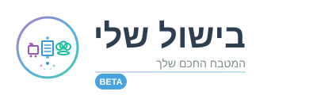
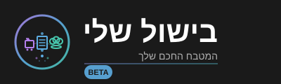
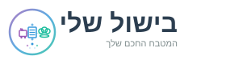

# BishulSheli Logo Package

Complete logo suite for BishulSheli (בישול שלי) - Your Smart Kitchen

## Domain
bishul.me

## Brand Name
**BishulSheli** (English) / **בישול שלי** (Hebrew)
Translation: "My Cooking"

---

## Files Included

### Primary Logos - Hebrew (עברית)

- **bishulsheli-logo-he.svg** (400x120px)
  - Main logo with tagline "המטבח החכם שלך"
  - Use: Website header, presentations, marketing materials in Israel

- **bishulsheli-logo-dark-he.svg** (400x120px)
  - Dark version for dark backgrounds
  - Use: Dark mode websites, dark backgrounds

### Primary Logos - English

- **bishulsheli-logo-en.svg** (400x120px)
  - Main logo with tagline "Your Smart Kitchen"
  - Use: International marketing, English content

- **bishulsheli-logo-dark-en.svg** (400x120px)
  - Dark version for dark backgrounds
  - Use: Dark mode websites, dark backgrounds

### Compact Versions

- **bishulsheli-logo-compact-he.svg** (300x80px) - Hebrew
- **bishulsheli-logo-compact-en.svg** (300x80px) - English
  - Icon + name only (no tagline)
  - Use: Small headers, email signatures, compact spaces

### Mobile Versions

- **bishulsheli-logo-mobile-he.svg** (280x80px) - Hebrew
- **bishulsheli-logo-mobile-en.svg** (280x80px) - English
  - Mobile-optimized with smaller elements and tagline
  - Use: Mobile applications, responsive designs

### Horizontal Versions

- **bishulsheli-logo-horizontal-he.svg** (200x60px) - Hebrew
- **bishulsheli-logo-horizontal-en.svg** (200x60px) - English
  - Ultra-compact horizontal layout
  - Use: Navigation bars, small headers, mobile headers

### Icon Versions (No Text - Universal)

- **bishulsheli-icon.svg** (80x80px)
  - Icon only without text - works for all languages
  - Use: App icons, social media profile pictures
  - Background: Light

- **bishulsheli-icon-dark.svg** (80x80px)
  - Dark version of icon
  - Use: Dark mode app icons
  - Background: Dark (#1a1a1a)

- **bishulsheli-favicon.svg** (32x32px)
  - Simplified favicon version
  - Use: Browser favicon, very small icons

### Social Media

- **bishulsheli-logo-square-he.svg** (400x400px) - Hebrew
- **bishulsheli-logo-square-en.svg** (400x400px) - English
  - Square format with centered icon and text
  - Use: Social media posts, profile pictures, thumbnails

---

## Color Scheme

### Light Version
- Purple: #9B59B6 (Shopping cart - inventory)
- Blue: #3498DB (Menu/Recipe center - recipes)
- Teal: #1ABC9C (Chef hat - cooking expertise)
- Text: #2C3E50
- Accent Text: #7F8C8D

### Dark Version
- Purple: #B37FEB (Shopping cart)
- Blue: #5DADE2 (Menu/Recipe center)
- Teal: #48C9B0 (Chef hat)
- Text: #FFFFFF
- Accent Text: #B0B0B0
- Background: #1a1a1a

---

## Icon Elements Meaning

- **Shopping Cart** (Left): Inventory management & shopping list
- **Menu/Recipe** (Center): Recipe database & meal planning
- **Chef Hat** (Right): Cooking expertise & guidance
- **Data Particles** (Bottom): AI intelligence & smart features
- **Connection Lines**: Integration between all features

---

## Taglines

### Hebrew
"המטבח החכם שלך" (Your Smart Kitchen)

### English
"Your Smart Kitchen"

---

## Usage Guidelines

### Language Selection
- **Hebrew version**: Primary for Israeli market (bishul.me users)
- **English version**: International users, documentation, API docs
- **Icon versions**: Universal - use when language is mixed or space limited

### Technical Guidelines
1. Maintain minimum clear space around logo (equal to icon height)
2. Don't stretch or distort proportions
3. Use dark version on dark backgrounds (below 50% brightness)
4. For sizes smaller than 32px, use favicon version
5. Use compact/horizontal for constrained spaces
6. Hebrew text uses RTL (right-to-left) rendering

### Web Implementation
```html
<!-- Light mode Hebrew (default for Israeli users) -->


<!-- Dark mode Hebrew -->


<!-- Mobile Hebrew -->


<!-- Favicon -->
<link rel="icon" href="bishulsheli-favicon.svg" type="image/svg+xml">
```

---

## 3D Printing Considerations

The round design with distinct elements is perfect for 3D printing:
- Clear circular boundary (38px radius in main version)
- Well-separated elements with minimum 4px spacing
- Simple geometric shapes (circles, rectangles, lines)
- No overlapping complex paths
- Suitable depth for embossing/debossing
- Use icon version for best 3D printing results

---

## File Formats

All files are SVG (Scalable Vector Graphics) format:
- ✅ Infinitely scalable without quality loss
- ✅ Small file size (perfect for web)
- ✅ Editable in vector graphics software
- ✅ Can be converted to PNG/JPG at any size
- ✅ Supports both LTR and RTL text rendering

---

## Export Recommendations

### Web
- Use SVG directly (preferred)
- Optimize SVGs with SVGO if needed

### Print
- Export to PDF for professional printing
- Or high-res PNG (300dpi+)

### Mobile Apps (iOS/Android)
- Export PNG at multiple resolutions:
  - 1x (base size)
  - 2x (retina)
  - 3x (super retina)

### 3D Printing
- Export icon version to DXF or STL format
- Recommended depth: 2-3mm for embossing

### Social Media Sizes
- Facebook: 1200x630px (use square-en or square-he)
- Instagram: 1080x1080px (use square versions)
- Twitter: 1200x675px (use main logo versions)
- LinkedIn: 1200x627px (use main logo versions)

---

## Project Context

BishulSheli is a multilingual smart cooking platform targeting the Israeli market with support for:
- Hebrew (עברית) - Primary language
- English - Secondary language
- Russian (Русский) - Community language

The platform provides:
- AI-powered recipe discovery
- Inventory management
- Meal planning
- Nutrition coaching
- Shopping list integration
- Multi-language recipe translation

Domain: **bishul.me** (בישול.me)

---

## License & Usage

These logos are proprietary to BishulSheli (bishul.me).
All rights reserved © 2024 BishulSheli

For partnership or licensing inquiries: [Your contact info]

---

## Version History

- v1.0 (November 2024) - Initial BishulSheli logo package
  - Created from MenuMindAI rebrand
  - Hebrew and English versions
  - 16 total logo variations
  - Optimized for Israeli market
